# game-playground

A playground for testing all things game related

> Many algorithms frankensteined from dark corners of the internet - use at your own risk

## Pathfinding

### A*

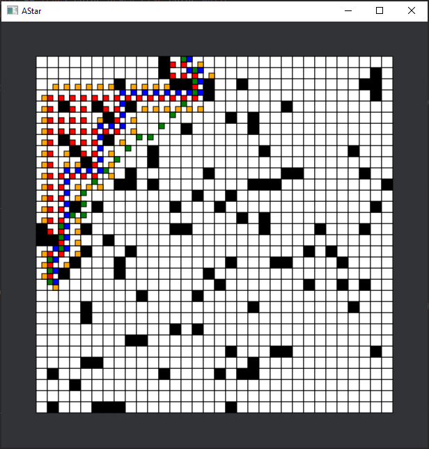

> Various implementations working and not

#### Hierarchical A*

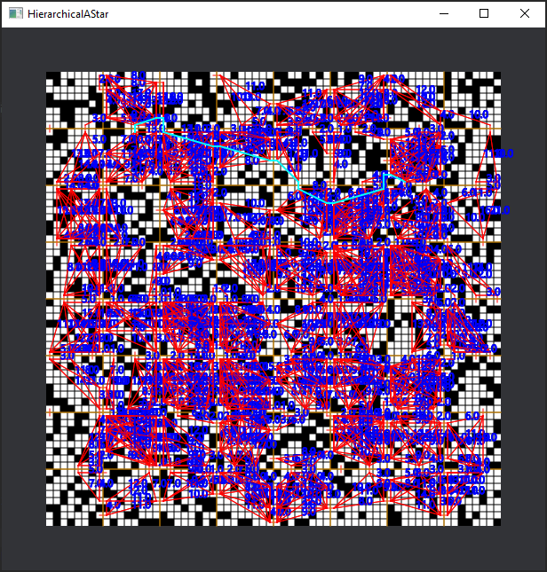

#### Enhanced hierarchical A*

Different pre-processing method used

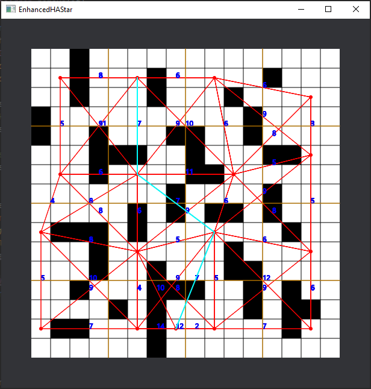

### Breadth first search

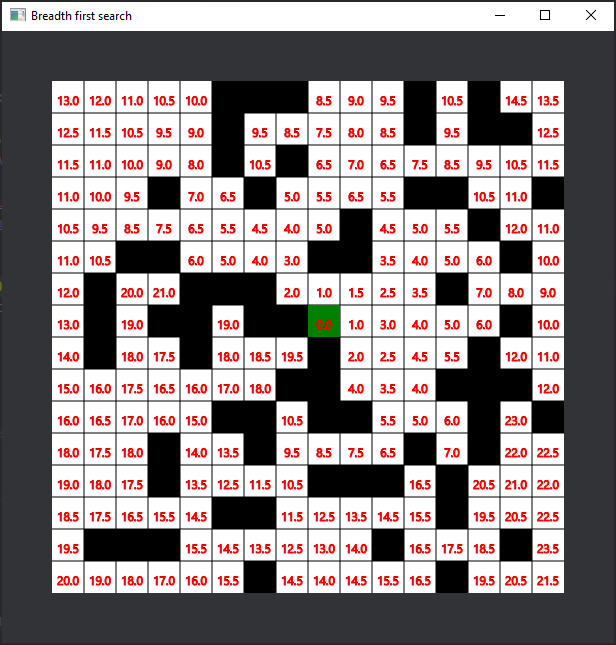

#### Bidirectional

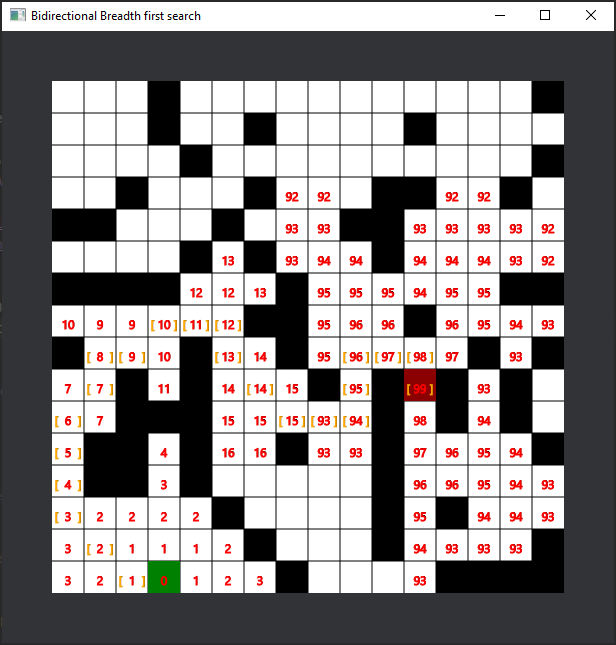

### Flood fill

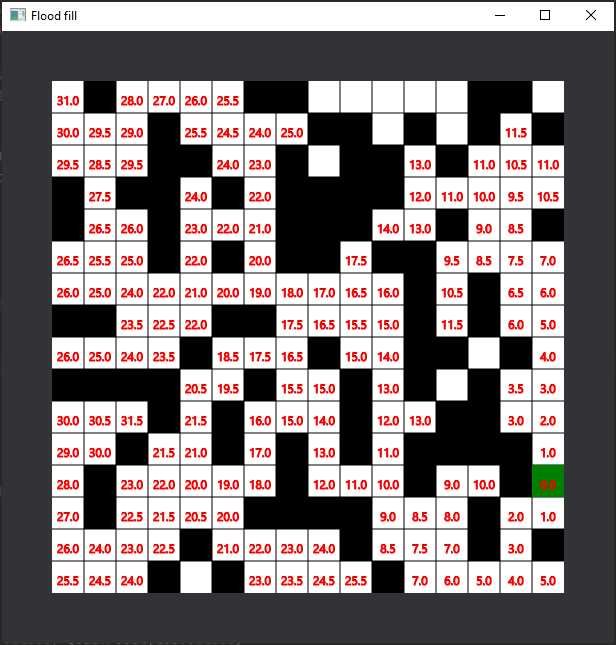

### Jump Point Search

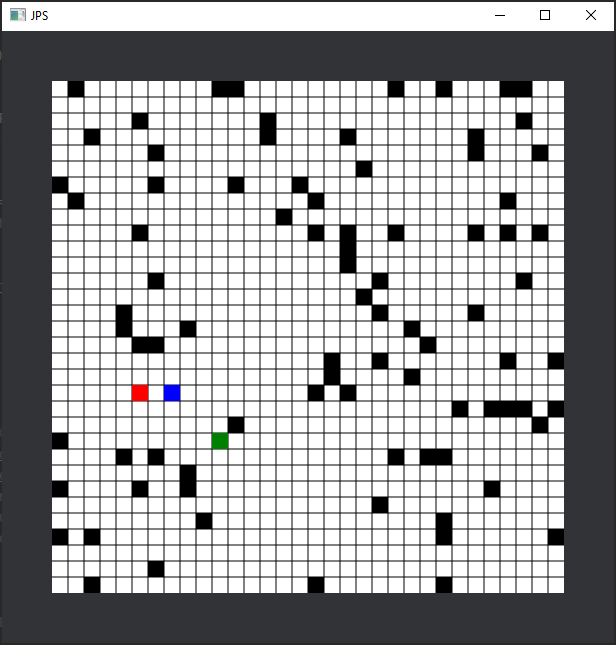

> Broken

### Jump Point Search vs A*

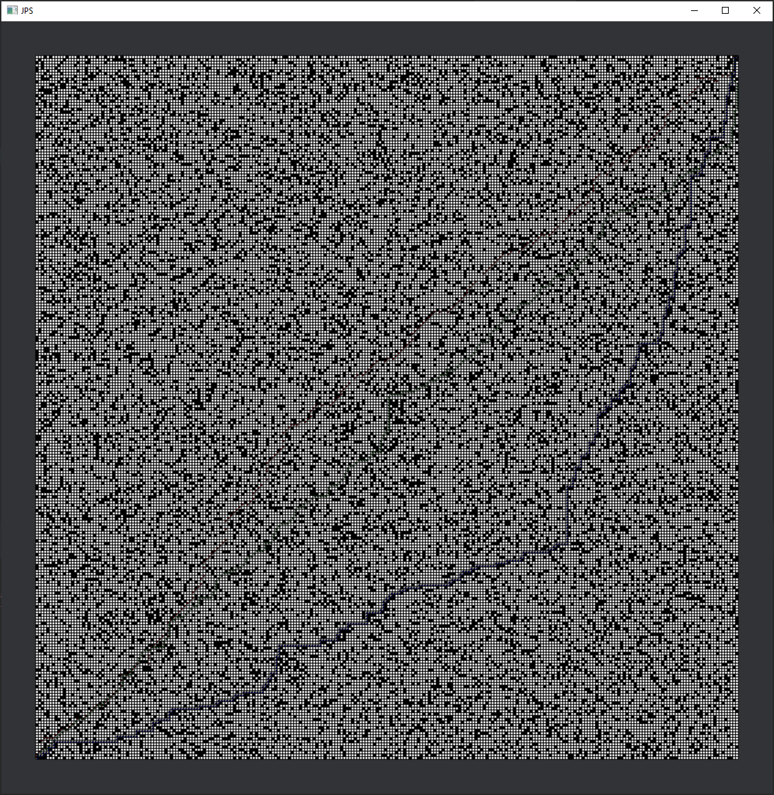

> Different JPS implementation

## Spatial

### DBSCAN Point clustering

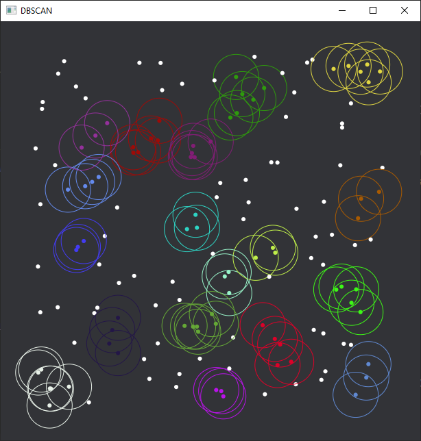

### Connected region grouping

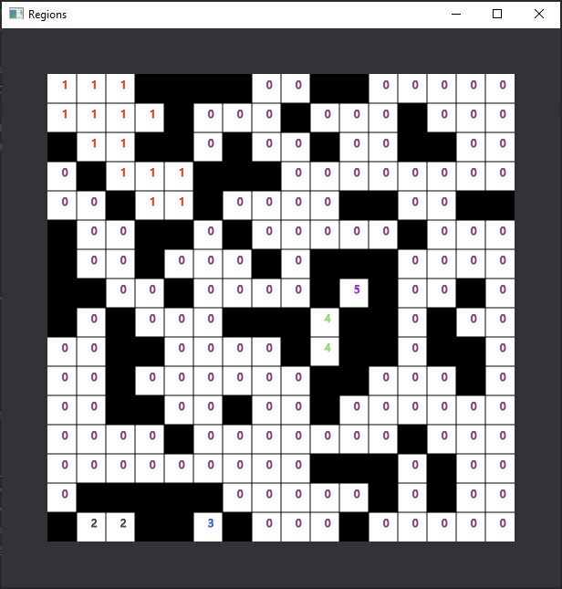

### Kruskals algorithm

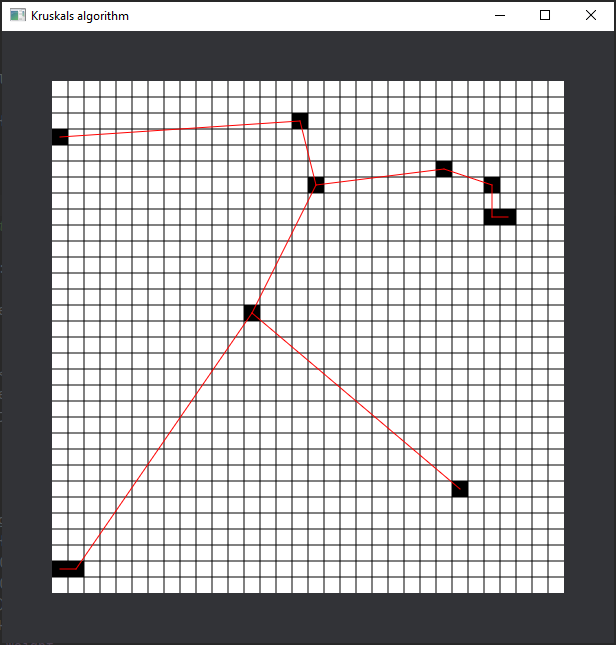

### Grid Smoothing

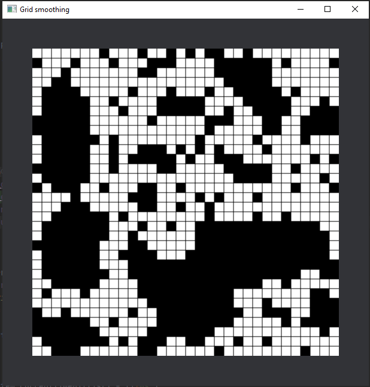

### Influence grid

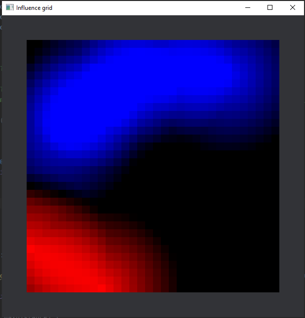

### K-Dimensional tree - Nearest neighbour

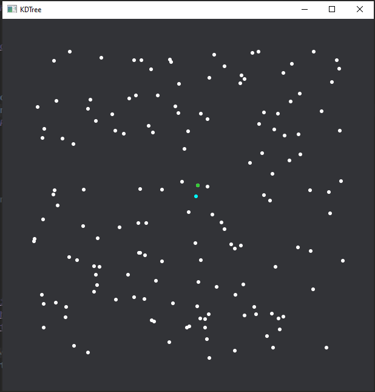

### PH Tree - Distances from wall (ordinally)

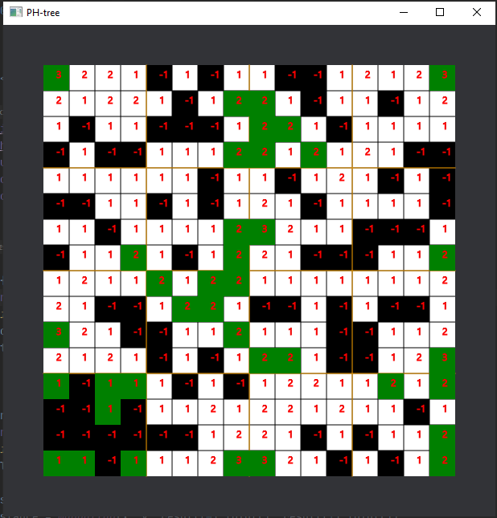

### Point QuadTree - Rectangle search

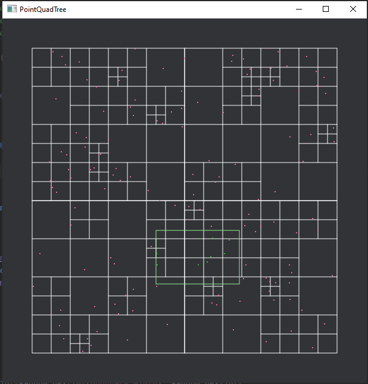

### Line of sight - Bresenham's line algorithm

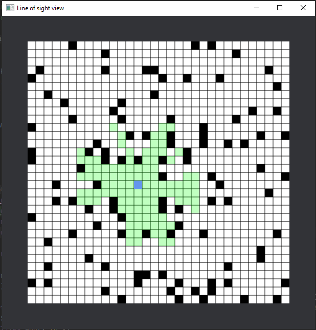

### Distance

The shortest distance between two rectangles

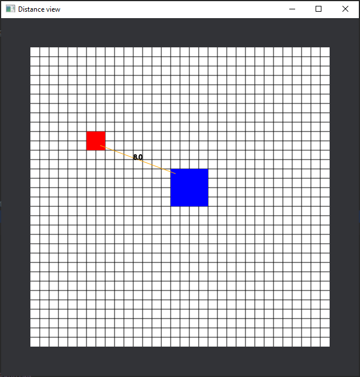

## AI

### Markov Decision Process (MDP)

#### Value Iteration

#### Policy Iteration

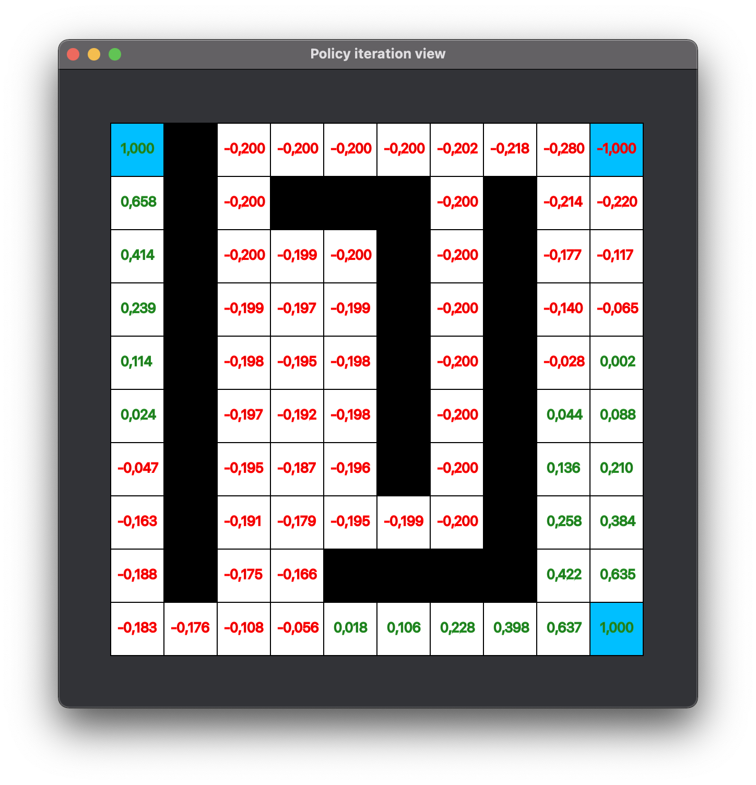